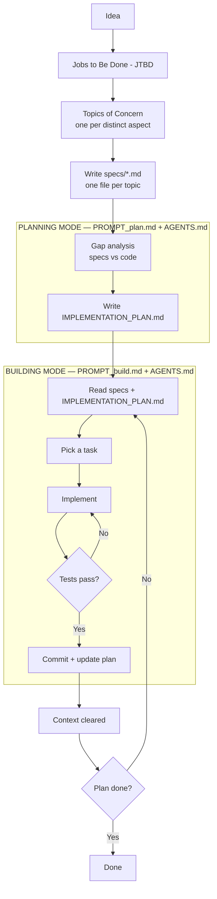

# Claude Code Enhancement

## 🔄 Ralph Loop

### [How to Ralph Wiggum](https://github.com/ghuntley/how-to-ralph-wiggum#)

#### Concepts

| Term                    | Definition                                                      |
| ----------------------- | --------------------------------------------------------------- |
| _Job to be Done (JTBD)_ | High-level user need or outcome                                 |
| _Topic of Concern_      | A distinct aspect/component within a JTBD                       |
| _Spec_                  | Requirements doc for one topic of concern (`specs/FILENAME.md`) |
| _Task_                  | Unit of work derived from comparing specs to code               |

_Relationships:_

- 1 JTBD → multiple topics of concern
- 1 topic of concern → 1 spec
- 1 spec → multiple tasks (specs are larger than tasks)

_Example:_

- JTBD: "Help designers create mood boards"
- Topics: image collection, color extraction, layout, sharing
- Each topic → one spec file
- Each spec → many tasks in implementation plan

#### Structure of the Project

```
project-root/
├── loop.sh                         # Ralph loop script
├── PROMPT_build.md                 # Build mode instructions
├── PROMPT_plan.md                  # Plan mode instructions
├── AGENTS.md                       # Operational guide loaded each iteration
├── IMPLEMENTATION_PLAN.md          # Prioritized task list (generated/updated by Ralph)
├── specs/                          # Requirement specs (one per JTBD topic)
│   ├── [jtbd-topic-a].md
│   └── [jtbd-topic-b].md
├── src/                            # Application source code
└── src/lib/                        # Shared utilities & components
```

Explanation:

- [loop.sh](https://github.com/ghuntley/how-to-ralph-wiggum?tab=readme-ov-file#loopsh): The outer loop script that orchestrates Ralph iterations.
- [PROMPT_build.md](https://github.com/ghuntley/how-to-ralph-wiggum?tab=readme-ov-file#prompt_planmd-template): The instruction set for each loop iteration in build mode.
- [PROMPT_plan.md](https://github.com/ghuntley/how-to-ralph-wiggum?tab=readme-ov-file#prompt_planmd-template): The instruction set for each loop iteration in plan mode.
- [AGENTS.md](https://github.com/ghuntley/how-to-ralph-wiggum?tab=readme-ov-file#prompt_planmd-template): Single, canonical "heart of the loop" - a concise, operational "how to run/build" guide.
- [IMPLEMENTATION_PLAN.md](https://github.com/ghuntley/how-to-ralph-wiggum?tab=readme-ov-file#implementation_planmd): Prioritized bullet-point list of tasks derived from gap analysis (specs vs code) - generated by Ralph.
- [specs/](https://github.com/ghuntley/how-to-ralph-wiggum?tab=readme-ov-file#specs): One markdown file per topic of concern. These are the source of truth for what should be built.
- [src/, src/lib/](https://github.com/ghuntley/how-to-ralph-wiggum?tab=readme-ov-file#src-and-srclib): Application source code and shared utilities/components.

### Workflow



**[Phase 1. Define Requirements (LLM conversation)](https://github.com/ghuntley/how-to-ralph-wiggum?tab=readme-ov-file#phase-1-define-requirements-llm-conversation)**

BRAINSTORMING mode:

- Discuss project ideas → identify Jobs to Be Done (JTBD)
- Break individual JTBD into topic(s) of concern
- Use subagents to load info from URLs into context
- LLM understands JTBD topic of concern: subagent writes `specs/FILENAME.md` for each topic

**[Phase 2 / 3. Run Ralph Loop (two modes, swap PROMPT.md as needed)](https://github.com/ghuntley/how-to-ralph-wiggum?tab=readme-ov-file#phase-2--3-run-ralph-loop-two-modes-swap-promptmd-as-needed)**

PLANNING mode loop lifecycle:

- Subagents study `specs/*` and existing `/src`
- Compare specs against code (gap analysis)
- Create/update `IMPLEMENTATION_PLAN.md` with prioritized tasks
- No implementation

BUILDING mode loop lifecycle:

- Orient – subagents study `specs/*` (requirements)
- Read plan – study `IMPLEMENTATION_PLAN.md`
- Select – pick the most important task
- Investigate – subagents study relevant `/src` ("don't assume not implemented")
- Implement – N subagents for file operations
- Validate – 1 subagent for build/tests (backpressure)
- Update `IMPLEMENTATION_PLAN.md` – mark task done, note discoveries/bugs
- Update `AGENTS.md` – if operational learnings
- Commit
- Loop ends → context cleared → next iteration starts fresh

#### Simple Ralph Loop

```bash
while :; do cat PROMPT.md | claude --dangerously-skip-permissions; done
```

**The mechanism**:

1. Bash loop runs → feeds `PROMPT.md` to claude
2. `PROMPT.md` instructs → "Study `specs/`, `src/`, `IMPLEMENTATION_PLAN.md` and choose the most important thing, Do it and update `IMPLEMENTATION_PLAN.md`"
3. Agent completes one task → updates `IMPLEMENTATION_PLAN.md` on disk, commits, exits
4. Bash loop restarts immediately → fresh context window
5. Agent reads updated plan → picks next most important thing

**Key insight:** The `IMPLEMENTATION_PLAN.md` file persists on disk between iterations and acts as shared state between otherwise isolated loop executions. Each iteration deterministically loads the same files (`PROMPT.md` + `AGENTS.md` + `specs/*`) and reads the current state from disk.

#### Enhanced Ralph Loop

Wraps core loop with mode selection (plan/build), max-iterations support, and git push after each iteration. This enhancement uses two saved prompt files:

- `PROMPT_plan.md` - Planning mode (gap analysis, generates/updates plan)
- `PROMPT_build.md` - Building mode (implements from plan)

```bash
#!/bin/bash
# Usage: ./loop.sh [plan] [max_iterations]
# Examples:
#   ./loop.sh              # Build mode, unlimited iterations
#   ./loop.sh 20           # Build mode, max 20 iterations
#   ./loop.sh plan         # Plan mode, unlimited iterations
#   ./loop.sh plan 5       # Plan mode, max 5 iterations

# Parse arguments
if [ "$1" = "plan" ]; then
    # Plan mode
    MODE="plan"
    PROMPT_FILE="PROMPT_plan.md"
    MAX_ITERATIONS=${2:-0}
elif [[ "$1" =~ ^[0-9]+$ ]]; then
    # Build mode with max iterations
    MODE="build"
    PROMPT_FILE="PROMPT_build.md"
    MAX_ITERATIONS=$1
else
    # Build mode, unlimited (no arguments or invalid input)
    MODE="build"
    PROMPT_FILE="PROMPT_build.md"
    MAX_ITERATIONS=0
fi

ITERATION=0
CURRENT_BRANCH=$(git branch --show-current)

echo "━━━━━━━━━━━━━━━━━━━━━━━━━━━━━━━━━━━━━━━━"
echo "Mode:   $MODE"
echo "Prompt: $PROMPT_FILE"
echo "Branch: $CURRENT_BRANCH"
[ $MAX_ITERATIONS -gt 0 ] && echo "Max:    $MAX_ITERATIONS iterations"
echo "━━━━━━━━━━━━━━━━━━━━━━━━━━━━━━━━━━━━━━━━"

# Verify prompt file exists
if [ ! -f "$PROMPT_FILE" ]; then
    echo "Error: $PROMPT_FILE not found"
    exit 1
fi

while true; do
    if [ $MAX_ITERATIONS -gt 0 ] && [ $ITERATION -ge $MAX_ITERATIONS ]; then
        echo "Reached max iterations: $MAX_ITERATIONS"
        break
    fi

    # Run Ralph iteration with selected prompt
    # -p: Headless mode (non-interactive, reads from stdin)
    # --dangerously-skip-permissions: Auto-approve all tool calls (YOLO mode)
    # --output-format=stream-json: Structured output for logging/monitoring
    # --model opus: Primary agent uses Opus for complex reasoning (task selection, prioritization)
    #               Can use 'sonnet' in build mode for speed if plan is clear and tasks well-defined
    # --verbose: Detailed execution logging
    cat "$PROMPT_FILE" | claude -p \
        --dangerously-skip-permissions \
        --output-format=stream-json \
        --model opus \
        --verbose

    # Push changes after each iteration
    git push origin "$CURRENT_BRANCH" || {
        echo "Failed to push. Creating remote branch..."
        git push -u origin "$CURRENT_BRANCH"
    }

    ITERATION=$((ITERATION + 1))
    echo -e "\n\n======================== LOOP $ITERATION ========================\n"
done
```

#### Key Principles

**1. ⏳ Context Is Everything**

- ~176K usable tokens with optimal usage at 40–60% ("smart zone")
- Spawn subagents to offload work and preserve main context for coordination
- Each subagent gets ~156KB of isolated context that's garbage-collected after use
- Keep specs concise — verbose inputs degrade determinism; markdown beats JSON for token efficiency

**2. 🧭 Steering Ralph: Patterns + Backpressure**

- _Upstream_: Load the same files (`PROMPT.md` + `AGENTS.md`) each loop iteration; ~5K tokens for specs
- _Downstream_: Use tests, lints, type-checks, and builds as backpressure to reject invalid output
- `AGENTS.md` carries project-specific commands; the prompt stays generic

**3. 🙏 Let Ralph Ralph**

- Trust the agent to self-correct through iteration — don't over-prescribe
- Embrace eventual consistency; let the plan and priorities emerge across loops

**4. 🚦 Move Outside the Loop**

- Your role is _environment engineer_, not participant
- Observe patterns, identify friction, add guardrails and signals to help future iterations succeed
- The plan is disposable — regenerate it when wrong rather than forcing a flawed strategy

### [Ralph Loop Plugin](https://github.com/anthropics/claude-plugins-official/tree/main/plugins/ralph-loop)

### [Ralph](https://github.com/snarktank/ralph)

### [Bmalph](https://github.com/LarsCowe/bmalph)

### [ralphmad](https://github.com/hieutrtr/ralphmad)

## 📋 Spec-Driven Development

### [Plannotator](https://plannotator.ai/) — AI-assisted planning and annotation

### [SpecKit](https://speckit.org/) — Specification toolkit for AI projects

### [SpecKit Docs](https://github.com/mduongvandinh/spec-kit-docs?tab=readme-ov-file) — Documentation for SpecKit

### [BMAD Method](https://docs.bmad-method.org/) — A structured methodology for AI-driven development

### [Agent OS](https://buildermethods.com/agent-os) - Agent OS helps you shape better specs, keeps agents aligned in a lightweight system that fits how you already build.

### [ai1-skills](https://github.com/hieutrtr/ai1-skills) — Community-built skill collection on GitHub

## 🌐 Online Resources

### [Superpowers](https://github.com/obra/superpowers) — A collection of skills for Claude Code

### [Awesome Claude Skills](https://github.com/BehiSecc/awesome-claude-skills) — A collection of skills for Claude Code - A curated list of Claude Skills.

### [awesome-claude-code](https://github.com/hesreallyhim/awesome-claude-code) — A curated list of awesome skills, hooks, slash-commands, agent orchestrators, applications, and plugins for Claude Code by Anthropic.

### [AI Templates Skills](https://www.aitmpl.com/skills) — Skill templates and examples

### [SkillsMP](https://skillsmp.com/) — Skills marketplace

### [Claude Marketplaces](https://claudemarketplaces.com/) — Browse and share Claude plugins

## 🔍 Code Quality Tools

### [Ruff](https://github.com/astral-sh/ruff)

### [myPy](https://mypy.readthedocs.io/en/stable/)

### [PMD](https://github.com/pmd/pmd)

### [Semgrep](https://github.com/semgrep/semgrep)

### [CodeQL](https://codeql.github.com/)

### [SonarQube](https://www.sonarqube.org/)

### [VeraCode](https://www.veracode.com/)

### [Coverity](https://www.blackduck.com/static-analysis-tools-sast/coverity.html)

### [BlackDuck](https://www.blackduck.com/)
