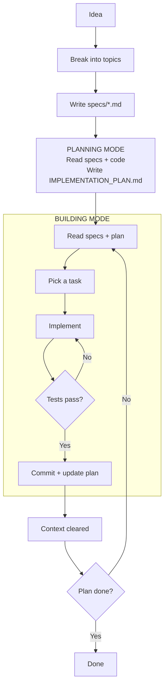
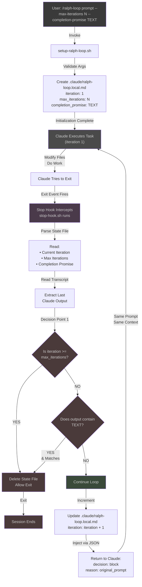
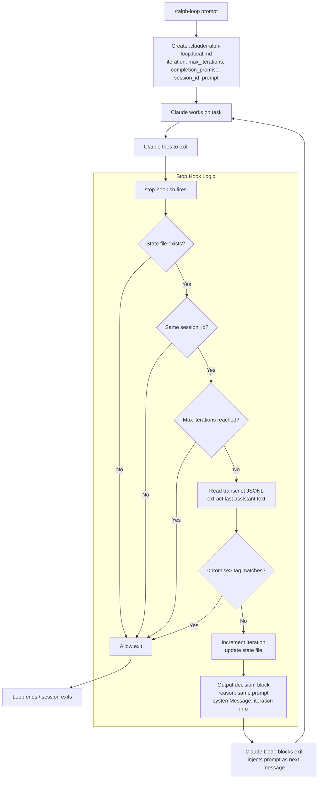

# Claude Code Enhancement

## 🔄 Ralph Loop

There are some variant of this idea but i love this phylosophy

> The technique is described as "deterministically bad in an undeterministic world" - failures are predictable, enabling systematic improvement through prompt tuning.

Meaning which the same prompt, the LLM some how failed around a some deterministic reasons, so, we can improve the prompt    
and support it success, it better and more understandable than let the LLM run success at the first without not sure it will    
correct in next time

### [How to Ralph Wiggum](https://github.com/ghuntley/how-to-ralph-wiggum#)

#### Concepts

| Term                    | Definition                                                      |
| ----------------------- | --------------------------------------------------------------- |
| _Job to be Done (JTBD)_ | High-level user need or outcome                                 |
| _Topic of Concern_      | A distinct aspect/component within a JTBD                       |
| _Spec_                  | Requirements doc for one topic of concern (`specs/FILENAME.md`) |
| _Task_                  | Unit of work derived from comparing specs to code               |

_Relationships:_

- 1 JTBD → multiple topics of concern
- 1 topic of concern → 1 spec
- 1 spec → multiple tasks (specs are larger than tasks)

_Example:_

- JTBD: "Help designers create mood boards"
- Topics: image collection, color extraction, layout, sharing
- Each topic → one spec file
- Each spec → many tasks in implementation plan

#### Structure of the Project

```
project-root/
├── loop.sh                         # Ralph loop script
├── PROMPT_build.md                 # Build mode instructions
├── PROMPT_plan.md                  # Plan mode instructions
├── AGENTS.md                       # Operational guide loaded each iteration
├── IMPLEMENTATION_PLAN.md          # Prioritized task list (generated/updated by Ralph)
├── specs/                          # Requirement specs (one per JTBD topic)
│   ├── [jtbd-topic-a].md
│   └── [jtbd-topic-b].md
├── src/                            # Application source code
└── src/lib/                        # Shared utilities & components
```

Explanation:

- [loop.sh](https://github.com/ghuntley/how-to-ralph-wiggum?tab=readme-ov-file#loopsh): The outer loop script that orchestrates Ralph iterations.
- [PROMPT_build.md](https://github.com/ghuntley/how-to-ralph-wiggum?tab=readme-ov-file#prompt_planmd-template): The instruction set for each loop iteration in build mode.
- [PROMPT_plan.md](https://github.com/ghuntley/how-to-ralph-wiggum?tab=readme-ov-file#prompt_planmd-template): The instruction set for each loop iteration in plan mode.
- [AGENTS.md](https://github.com/ghuntley/how-to-ralph-wiggum?tab=readme-ov-file#prompt_planmd-template): Single, canonical "heart of the loop" - a concise, operational "how to run/build" guide.
- [IMPLEMENTATION_PLAN.md](https://github.com/ghuntley/how-to-ralph-wiggum?tab=readme-ov-file#implementation_planmd): Prioritized bullet-point list of tasks derived from gap analysis (specs vs code) - generated by Ralph.
- [specs/](https://github.com/ghuntley/how-to-ralph-wiggum?tab=readme-ov-file#specs): One markdown file per topic of concern. These are the source of truth for what should be built.
- [src/, src/lib/](https://github.com/ghuntley/how-to-ralph-wiggum?tab=readme-ov-file#src-and-srclib): Application source code and shared utilities/components.

#### Workflow



**[Phase 1. Define Requirements (LLM conversation)](https://github.com/ghuntley/how-to-ralph-wiggum?tab=readme-ov-file#phase-1-define-requirements-llm-conversation)**

BRAINSTORMING mode:

- Discuss project ideas → identify Jobs to Be Done (JTBD)
- Break individual JTBD into topic(s) of concern
- Use subagents to load info from URLs into context
- LLM understands JTBD topic of concern: subagent writes `specs/FILENAME.md` for each topic

**[Phase 2 / 3. Run Ralph Loop (two modes, swap PROMPT.md as needed)](https://github.com/ghuntley/how-to-ralph-wiggum?tab=readme-ov-file#phase-2--3-run-ralph-loop-two-modes-swap-promptmd-as-needed)**

PLANNING mode loop lifecycle:

- Subagents study `specs/*` and existing `/src`
- Compare specs against code (gap analysis)
- Create/update `IMPLEMENTATION_PLAN.md` with prioritized tasks
- No implementation

BUILDING mode loop lifecycle:

- Orient – subagents study `specs/*` (requirements)
- Read plan – study `IMPLEMENTATION_PLAN.md`
- Select – pick the most important task
- Investigate – subagents study relevant `/src` ("don't assume not implemented")
- Implement – N subagents for file operations
- Validate – 1 subagent for build/tests (backpressure)
- Update `IMPLEMENTATION_PLAN.md` – mark task done, note discoveries/bugs
- Update `AGENTS.md` – if operational learnings
- Commit
- Loop ends → context cleared → next iteration starts fresh

#### Simple Ralph Loop

```bash
while :; do cat PROMPT.md | claude --dangerously-skip-permissions; done
```

**The mechanism**:

1. Bash loop runs → feeds `PROMPT.md` to claude
2. `PROMPT.md` instructs → "Study `specs/`, `src/`, `IMPLEMENTATION_PLAN.md` and choose the most important thing, Do it and update `IMPLEMENTATION_PLAN.md`"
3. Agent completes one task → updates `IMPLEMENTATION_PLAN.md` on disk, commits, exits
4. Bash loop restarts immediately → fresh context window
5. Agent reads updated plan → picks next most important thing

**Key insight:** The `IMPLEMENTATION_PLAN.md` file persists on disk between iterations and acts as shared state between otherwise isolated loop executions. Each iteration deterministically loads the same files (`PROMPT.md` + `AGENTS.md` + `specs/*`) and reads the current state from disk.

#### Enhanced Ralph Loop

Wraps core loop with mode selection (plan/build), max-iterations support, and git push after each iteration. This enhancement uses two saved prompt files:

- `PROMPT_plan.md` - Planning mode (gap analysis, generates/updates plan)
- `PROMPT_build.md` - Building mode (implements from plan)

```bash
#!/bin/bash
# Usage: ./loop.sh [plan] [max_iterations]
# Examples:
#   ./loop.sh              # Build mode, unlimited iterations
#   ./loop.sh 20           # Build mode, max 20 iterations
#   ./loop.sh plan         # Plan mode, unlimited iterations
#   ./loop.sh plan 5       # Plan mode, max 5 iterations

# Parse arguments
if [ "$1" = "plan" ]; then
    # Plan mode
    MODE="plan"
    PROMPT_FILE="PROMPT_plan.md"
    MAX_ITERATIONS=${2:-0}
elif [[ "$1" =~ ^[0-9]+$ ]]; then
    # Build mode with max iterations
    MODE="build"
    PROMPT_FILE="PROMPT_build.md"
    MAX_ITERATIONS=$1
else
    # Build mode, unlimited (no arguments or invalid input)
    MODE="build"
    PROMPT_FILE="PROMPT_build.md"
    MAX_ITERATIONS=0
fi

ITERATION=0
CURRENT_BRANCH=$(git branch --show-current)

echo "━━━━━━━━━━━━━━━━━━━━━━━━━━━━━━━━━━━━━━━━"
echo "Mode:   $MODE"
echo "Prompt: $PROMPT_FILE"
echo "Branch: $CURRENT_BRANCH"
[ $MAX_ITERATIONS -gt 0 ] && echo "Max:    $MAX_ITERATIONS iterations"
echo "━━━━━━━━━━━━━━━━━━━━━━━━━━━━━━━━━━━━━━━━"

# Verify prompt file exists
if [ ! -f "$PROMPT_FILE" ]; then
    echo "Error: $PROMPT_FILE not found"
    exit 1
fi

while true; do
    if [ $MAX_ITERATIONS -gt 0 ] && [ $ITERATION -ge $MAX_ITERATIONS ]; then
        echo "Reached max iterations: $MAX_ITERATIONS"
        break
    fi

    # Run Ralph iteration with selected prompt
    # -p: Headless mode (non-interactive, reads from stdin)
    # --dangerously-skip-permissions: Auto-approve all tool calls (YOLO mode)
    # --output-format=stream-json: Structured output for logging/monitoring
    # --model opus: Primary agent uses Opus for complex reasoning (task selection, prioritization)
    #               Can use 'sonnet' in build mode for speed if plan is clear and tasks well-defined
    # --verbose: Detailed execution logging
    cat "$PROMPT_FILE" | claude -p \
        --dangerously-skip-permissions \
        --output-format=stream-json \
        --model opus \
        --verbose

    # Push changes after each iteration
    git push origin "$CURRENT_BRANCH" || {
        echo "Failed to push. Creating remote branch..."
        git push -u origin "$CURRENT_BRANCH"
    }

    ITERATION=$((ITERATION + 1))
    echo -e "\n\n======================== LOOP $ITERATION ========================\n"
done
```

#### Key Principles

**1. ⏳ Context Is Everything**

- ~176K usable tokens with optimal usage at 40–60% ("smart zone")
- Spawn subagents to offload work and preserve main context for coordination
- Each subagent gets ~156KB of isolated context that's garbage-collected after use
- Keep specs concise — verbose inputs degrade determinism; markdown beats JSON for token efficiency

**2. 🧭 Steering Ralph: Patterns + Backpressure**

- _Upstream_: Load the same files (`PROMPT.md` + `AGENTS.md`) each loop iteration; ~5K tokens for specs
- _Downstream_: Use tests, lints, type-checks, and builds as backpressure to reject invalid output
- `AGENTS.md` carries project-specific commands; the prompt stays generic

**3. 🙏 Let Ralph Ralph**

- Trust the agent to self-correct through iteration — don't over-prescribe
- Embrace eventual consistency; let the plan and priorities emerge across loops

**4. 🚦 Move Outside the Loop**

- Your role is _environment engineer_, not participant
- Observe patterns, identify friction, add guardrails and signals to help future iterations succeed
- The plan is disposable — regenerate it when wrong rather than forcing a flawed strategy

### [Ralph Loop Plugin](https://github.com/anthropics/claude-plugins-official/tree/main/plugins/ralph-loop)

Install:

```bash
# Open Claude interactive mode
claude
# Open plugin menu
/plugin
# Choose "Ralph Loop"
```

Ralph Loop brings the Ralph Wiggum technique into your current Claude Code session using a stop hook instead of an external bash loop.

**Core mechanic:** The same prompt is fed to Claude repeatedly. Claude sees its own previous work in files/git history each iteration and builds incrementally toward the goal. Each iteration:

1. Claude receives the SAME prompt
2. Works on the task, modifying files
3. Tries to exit
4. Stop hook intercepts and feeds the same prompt again
5. Claude sees its previous work in the files
6. Iteratively improves until completion

The technique is described as "deterministically bad in an undeterministic world" - failures are predictable, enabling systematic improvement through prompt tuning.

#### Architecture

| File                          | Purpose                                                                   |
| ----------------------------- | ------------------------------------------------------------------------- |
| `scripts/setup-ralph-loop.sh` | Parses CLI args, creates the state file, outputs initial prompt           |
| `hooks/stop-hook.sh`          | The core engine — intercepts session exit and feeds the prompt back       |
| `hooks/hooks.json`            | Registers the stop hook on the Stop event                                 |
| `commands/ralph-loop.md`      | `/ralph-loop` slash command — runs setup script, then hands off to Claude |
| `commands/cancel-ralph.md`    | `/cancel-ralph` slash command — removes state file to cancel the loop     |
| `commands/help.md`            | `/help` command — explains the plugin                                     |

#### How It Works

**1. Startup** (`/ralph-loop "prompt" --max-iterations N --completion-promise "TEXT"`)

`setup-ralph-loop.sh` runs and creates `.claude/ralph-loop.local.md`, a markdown file with YAML frontmatter:

```yaml
---
active: true
iteration: 1
session_id: <session_id>
max_iterations: 20
completion_promise: "DONE"
started_at: "2026-03-17T..."
---
<the user's prompt>
```

Claude then works on the task normally.

**2. The Loop** (`stop-hook.sh`)

When Claude tries to exit the session, the Stop hook fires. It:

1. Checks if `.claude/ralph-loop.local.md` exists → if not, allows exit
2. **Session isolation:** reads `session_id` from state file and compares with `$HOOK_INPUT.session_id` → if different session started the loop, allows exit (prevents cross-session interference)
3. Validates `iteration` and `max_iterations` are numeric (safeguard against corrupted state)
4. Checks **max iterations:** if `iteration >= max_iterations`, deletes state file and allows exit
5. Checks the **transcript:** reads the JSONL transcript file, extracts the last assistant text block
6. Checks **completion promise:** uses Perl regex to find `<promise>TEXT</promise>` in the last output. If it matches, exits cleanly
7. **Continues the loop:** increments iteration, updates the state file atomically (via temp file + `mv`), then outputs:

```json
{
  "decision": "block",
  "reason": "<the original prompt>",
  "systemMessage": "🔄 Ralph iteration 2 | To stop: output <promise>DONE</promise>"
}
```

The `"decision": "block"` response prevents Claude from exiting — and `"reason"` is the prompt fed back as Claude's next task.

#### Key Design Decisions

- **Same prompt every iteration** — Claude's "improvement" comes from seeing its own modified files and git history, not from the prompt changing
- **State in a project-scoped file** — `.claude/ralph-loop.local.md` (`.local.md` suffix signals it's gitignored/local)
- **Session isolation** — `session_id` field prevents the hook from hijacking other Claude sessions in the same project
- **Atomic state update** — temp file + `mv` prevents corruption during iteration counter increment
- **Completion via `<promise>` tags** — Claude must output `<promise>DONE</promise>` (only when true); exact string match using `=` (not `==`) avoids glob expansion issues with special chars
- **Safety** — `--max-iterations` is the escape hatch; without it OR a completion promise, the loop runs infinitely

#### The Mechanisms

1. **Command Invocation**
   - User runs `/ralph-loop <prompt> --max-iterations <n> --completion-promise "<promise>"`

2. **Setup Phase**
   - `setup-ralph-loop.sh` validates arguments
   - Creates `.claude/ralph-loop.local.md` with YAML frontmatter:
     - `iteration: 1`
     - `max_iterations: N`
     - `completion_promise: TEXT`
     - `prompt: <original prompt>`

3. **Execution Phase**
   - Claude works on the task
   - Modifies files as needed

4. **Exit Attempt**
   - Claude tries to exit the session

5. **Stop Hook Interception** (automatic)
   - Stop hook (already registered in `hooks.json`) fires automatically
   - Reads state from `.claude/ralph-loop.local.md`
   - Extracts Claude's last output from transcript

6. **Condition Checking**
   - **Check 1**: Is `max_iterations` reached?
     - YES → Delete state file, allow exit (stop loop)
     - NO → Continue to next check
   - **Check 2**: Is completion promise detected in output?
     - YES → Delete state file, allow exit (stop loop)
     - NO → Continue loop

7. **Continue Loop**
   - Increment iteration counter in state file
   - Extract original prompt from state file
   - Inject same prompt back to Claude (via JSON with `"decision": "block"`)
   - Claude's context continues with new input
   - Return to step 3 (execution phase)

Loop termination only when:
- `max_iterations` limit is reached, OR
- Claude outputs `<promise>COMPLETION_PROMISE</promise>` matching the configured promise

---

Claude code harness mechanism:



Stop Hook Workflow:



#### Commands

**Start a loop:**

```bash
/ralph-loop "your task description" [OPTIONS]
```

**Options:**

- `--max-iterations <n>` — stop after N iterations
- `--completion-promise <text>` — stop when Claude outputs this phrase in a `<promise>` tag

**Cancel a loop:**

```bash
/cancel-ralph
```

#### Completion Signal

To end the loop, Claude must output:

```html
<promise>TASK COMPLETE</promise>
```

Without this (or `--max-iterations`), the loop runs indefinitely.

#### When to use

| Good for                                       | Not good for                 |
| ---------------------------------------------- | ---------------------------- |
| Well-defined tasks with clear success criteria | Tasks needing human judgment |
| Iterative refinement & self-correction         | One-shot operations          |
| Greenfield projects                            | Unclear success criteria     |

#### Philosophy

1. **Iteration > Perfection** - Don't aim for perfect on first try. Let the loop refine the work.
2. **Failures Are Data** - "Deterministically bad" means failures are predictable and informative. Use them to tune prompts.
3. **Operator Skill Matters** - Success depends on writing good prompts, not just having a good model.
4. **Persistence Wins** - Keep trying until success. The loop handles retry logic automatically.

#### Best Practices

1. Clear Completion Criteria
2. Incremental Goals
3. Self-Correction
4. Escape Hatches: Always use `--max-iterations` as a safety net to prevent infinite loops on impossible tasks

#### Example

```
# Use --max-iterations when you want to run a task exactly N times
/ralph-loop:ralph-loop SAY HELLO --max-iterations 3

# Use --completion-promise when you don’t know how many iterations it will take
/ralph-loop:ralph-loop SAY HELLO --completion-promise "DONE"

# Use both when you don’t know exactly when the task will finish,
# but you want to prevent it from running infinitely
/ralph-loop:ralph-loop SAY HELLO --completion-promise "DONE" --max-iterations 3
```

### Ralph Loop Variants

- [ralphmad](https://github.com/hieutrtr/ralphmad): `ralph-loop` + BMAD SDLC on top. Stop-hook mechanism, but prompt is a template populated from project artifacts at runtime. 14 phase-gated workflows (product brief → PRD → architecture → epics → implementation). Human manually triggers each phase. Claude Code only.

- [Ralph](https://github.com/snarktank/ralph): Generic Ralph variant. External bash loop, fresh context each iteration. Task list in prd.json (passes: true/false). Supports both Amp and Claude Code. Has a React flowchart visualizer as docs.

- [Bmalph](https://github.com/LarsCowe/bmalph): Full production tool. npm CLI (bmalph run) with Node.js TUI dashboard, external bash loop, multi-platform (Claude Code/Codex/Cursor/Windsurf/Copilot/Aider). Bundles BMAD + Ralph. Human does planning interactively, then fully automated implementation. Circuit breaker, rate limiting, detach support. 

## 📋 Spec-Driven Development

[More detail](./spec-driven-development.md)

## 🌐 Online Resources

### [Superpowers](https://github.com/obra/superpowers) — A collection of skills for Claude Code

### [Awesome Claude Skills](https://github.com/BehiSecc/awesome-claude-skills) — A collection of skills for Claude Code - A curated list of Claude Skills.

### [awesome-claude-code](https://github.com/hesreallyhim/awesome-claude-code) — A curated list of awesome skills, hooks, slash-commands, agent orchestrators, applications, and plugins for Claude Code by Anthropic.

### [AI Templates Skills](https://www.aitmpl.com/skills) — Skill templates and examples

### [SkillsMP](https://skillsmp.com/) — Skills marketplace

### [Claude Marketplaces](https://claudemarketplaces.com/) — Browse and share Claude plugins

## 🔍 Code Quality Tools

### [Ruff](https://github.com/astral-sh/ruff)

### [myPy](https://mypy.readthedocs.io/en/stable/)

### [PMD](https://github.com/pmd/pmd)

### [Semgrep](https://github.com/semgrep/semgrep)

### [CodeQL](https://codeql.github.com/)

### [SonarQube](https://www.sonarqube.org/)

### [VeraCode](https://www.veracode.com/)

### [Coverity](https://www.blackduck.com/static-analysis-tools-sast/coverity.html)

### [BlackDuck](https://www.blackduck.com/)

## 📐 Design

| Tool              | Auto Nav from Folder | llms.txt Auto | Heading Anchors | MDX        | Mermaid    | PlantUML   | Self-host        | Search Built-in   | Build ~100 files | Build ~5000 files | Price |
|-------------------|---------------------|---------------|------------------|------------|------------|------------|------------------|-------------------|------------------|-------------------|-------|
| [MkDocs Material](https://squidfunk.github.io/mkdocs-material/) | ✓ plugin | ✓ plugin | ✓ | ✗ (macros) | ✓ built-in | ✓ plugin | ✓ | ✓ built-in | ~2s | ~60-120s | free |
| [Astro Starlight](https://starlight.astro.build/) | ✓ built-in | ✓ plugin | ✓ | ✓ | ~ plugin | ~ plugin | ✓ | ✓ Pagefind | ~10s | ~8-15min | free |
| [Docusaurus](https://docusaurus.io/) | ~ plugin | ✗ manual | ✓ | ✓ | ~ plugin | ~ plugin | ✓ | ~ Algolia/local | ~15s | ~10-20min | free |
| [VitePress](https://vitepress.dev/) | ✗ manual | ✗ manual | ✓ | ✗ (Vue) | ~ plugin | ~ plugin | ✓ | ✓ built-in | ~5s | ~3-6min | free |
| [Nextra](https://nextra.site/) | ✓ file-based | ✗ manual | ✓ | ✓ | ~ plugin | ~ plugin | ✓ | ✓ Flexsearch | ~10s | ~8-15min | free |
| [Mintlify](https://mintlify.com/) | ✓ built-in | ✓ built-in | ✓ | ✓ | ✓ built-in | ✗ | ✗ hosted only | ✓ built-in | instant | instant | paid |
| [GitBook](https://www.gitbook.com/) | ✓ built-in | ✗ | ✓ | ✗ | ✓ built-in | ✗ | ✗ hosted only | ✓ built-in | instant | instant | paid |

---

**Legend:** ✓ = native support / ✗ = not supported / ~ = needs plugin or extra config

---

### Takeaway

- Best overall self-hosted: **MkDocs Material** — fastest build, most complete auto-indexing  
- Best if you need MDX: **Astro Starlight** — close second, good plugin ecosystem  
- Best if budget is available: **Mintlify** — zero config, everything built-in, but no self-hosting
