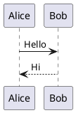
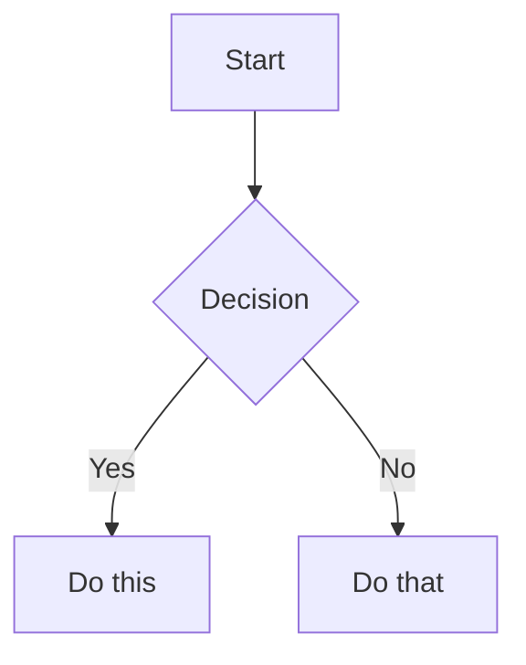

# MkDocs Documentation Setup

## Folder Structure

```
my-docs/
├── docs/                        # paste your existing docs folder here
│   ├── getting-started/
│   │   └── ...
│   ├── api/
│   │   ├── core/
│   │   │   └── ...
│   │   └── integrations/
│   │       └── ...             # any depth works, no limit
│   └── guides/
│       └── ...
├── scripts/
│   └── gen_nav.py               # auto-generates nav from folder tree
├── overrides/                   # optional: theme customization
├── mkdocs.yml                   # main config
└── requirements.txt
```

---

## requirements.txt

```txt
mkdocs-material>=9.5
mkdocs-llmstxt
mkdocs-gen-files
mkdocs-literate-nav
mkdocs-awesome-pages-plugin
mkdocs-kroki                    # plantUML, graphviz, etc via kroki.io
```

---

## Install

```bash
pip install -r requirements.txt
```

---

## mkdocs.yml

```yaml
site_name: My Docs
site_url: https://yourdomain.com

theme:
  name: material
  features:
    - navigation.tabs           # top-level folders as tabs
    - navigation.sections       # expandable sections in sidebar
    - navigation.indexes        # folder index pages (index.md)
    - navigation.prune          # hide unexpanded sections (perf at 5000 files)
    - navigation.top            # back to top button
    - search.highlight
    - search.suggest
    - content.code.copy         # copy button on code blocks

plugins:
  - search
  - gen-files:
      scripts:
        - scripts/gen_nav.py    # auto-scan docs/ and build nav
  - literate-nav:
      nav_file: SUMMARY.md
  - awesome-pages
  - llmstxt:
      full_output: llms-full.txt  # full content dump for RAG
  - kroki:                        # PlantUML, Mermaid via kroki.io
      ServerURL: https://kroki.io  # or self-host kroki

markdown_extensions:
  - pymdownx.superfences:
      custom_fences:
        - name: mermaid
          class: mermaid
          format: !!python/name:pymdownx.superfences.fence_code_format
        - name: plantuml
          class: kroki-plantuml
          format: !!python/name:mkdocs_kroki.fences.fence_kroki
  - pymdownx.highlight:
      anchor_linenums: true
  - pymdownx.inlinehilite
  - pymdownx.tabbed:
      alternate_style: true
  - pymdownx.details
  - admonition
  - footnotes
  - attr_list
  - md_in_html
  - toc:
      permalink: true           # adds # anchor link icon on every heading

extra_javascript:
  - https://unpkg.com/mermaid@10/dist/mermaid.min.js
```

---

## scripts/gen_nav.py

Auto-generates navigation from your folder structure. No manual nav config needed.

```python
from pathlib import Path
import mkdocs_gen_files

nav = mkdocs_gen_files.Nav()

for path in sorted(Path("docs").rglob("*.md")):
    doc_path = path.relative_to("docs")
    nav[doc_path.parts] = str(doc_path)

with mkdocs_gen_files.open("SUMMARY.md", "w") as nav_file:
    nav_file.write(nav.build_literate_nav())
```

---

## Essential Commands

```bash
# local dev — only rebuilds changed files (fast even at 5000 files)
mkdocs serve --dirty

# full build → outputs to site/
mkdocs build

# build without llms-full.txt (faster in dev)
MKDOCS_LLMSTXT_SKIP_FULL=1 mkdocs build
```

---

## Search

Search is **built-in and automatic** via the `search` plugin in mkdocs.yml.

- **Indexes all** `.md` files in `docs/`
- **Client-side search** (no backend needed) — search index is prebuilt at `site/search/search_index.json`
- **Works offline** once the site is loaded
- **Searches in**: page titles, headings, content
- **Exclude files** from search if needed:

```yaml
plugins:
  - search:
      exclude:
        - api/generated/**      # skip large auto-generated folders
        - admin/**              # or internal-only sections
```

---

## What Gets Auto-Generated

| Output | URL | Purpose |
|---|---|---|
| Site pages | `yoursite.com/api/core/messages/` | Human browsing |
| Heading anchors | `yoursite.com/api/core/messages/#dictionary-format` | Deep links to sections |
| Search index | `yoursite.com/search/search_index.json` | Human/AI search |
| `llms.txt` | `yoursite.com/llms.txt` | AI page-level index |
| `llms-full.txt` | `yoursite.com/llms-full.txt` | AI full content dump for RAG |

---

## Self-Hosting

MkDocs outputs a static `site/` folder — host it anywhere.

### Nginx

```nginx
server {
    listen 80;
    server_name yourdomain.com;
    root /var/www/my-docs/site;
    index index.html;

    location / {
        try_files $uri $uri/ $uri/index.html =404;
    }
}
```

```bash
mkdocs build
cp -r site/ /var/www/my-docs/
```

### Docker

```dockerfile
FROM nginx:alpine
COPY site/ /usr/share/nginx/html
```

```bash
mkdocs build
docker build -t my-docs .
docker run -p 8080:80 my-docs
```

### GitHub Pages

```bash
mkdocs gh-deploy
```

---

## Migrating Your Existing docs/

```bash
# 1. create project
mkdocs new my-docs
cd my-docs

# 2. remove generated placeholder
rm -rf docs/

# 3. copy your existing folder in
cp -r /path/to/your/existing/docs ./docs

# 4. install deps
pip install -r requirements.txt

# 5. run
mkdocs serve --dirty
```

No frontmatter needed. No restructuring needed. Works as-is.

---

## PlantUML Example (via Kroki)

````markdown

````

## Mermaid Example

````markdown

````

---

## Performance Tips for 5000+ Files

- Always use `mkdocs serve --dirty` during development
- Enable `navigation.prune` in theme features (already in config above)
- If search is slow, exclude large auto-generated files:

```yaml
plugins:
  - search:
      exclude:
        - api/generated/**
```
